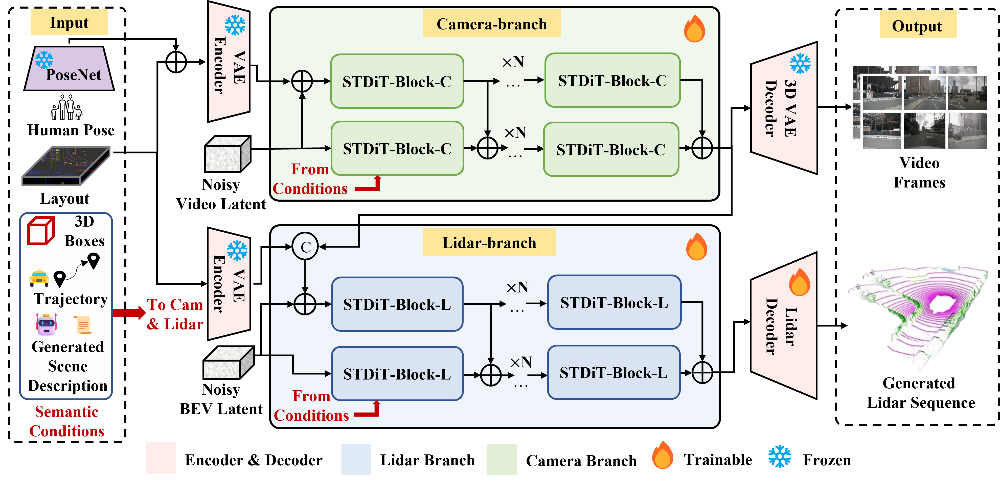

<h3>Genesis: Multimodal Driving Scene Generation with Spatio-Temporal and Cross-Modal Consistency</h3>

Xiangyu Guo1\*, Zhanqian Wu2\*, Kaixin Xiong2\*, Ziyang Xu1, Lijun Zhou2, Gangwei Xu1, Shaoqing Xu2,   Haiyang Sun2†,  Bing Wang2, Guang Chen2, Hangjun Ye2, Wenyu Liu1, Xinggang Wang1,✉

1  Huazhong University of Science & Technology, 2  Xiaomi EV 

(\*) Equal contribution. (†) Project leader. (✉)Corresponding Author.

<!-- ## Introduction -->
## Abstract
We present Genesis, a unified framework for joint generation of multi-view driving videos and LiDAR sequences with spatio-temporal and cross-modal consistency. Genesis employs a two-stage architecture that integrates a DiT-based video diffusion model with 3D-VAE encoding, and a BEV-aware LiDAR generator with NeRF-based rendering and adaptive sampling. Both modalities are directly coupled through a shared latent space, enabling coherent evolution across visual and geometric domains. To guide the generation with structured semantics, we introduce DataCrafter, a captioning module built on vision-language models that provides scene-level and instance-level supervision. Extensive experiments on the nuScenes benchmark demonstrate that Genesis achieves state-of-the-art performance across video and LiDAR metrics (FVD 16.95, FID 4.24, Chamfer 0.611), and benefits downstream tasks including segmentation and 3D detection, validating the semantic fidelity and practical utility of the generated data.

## Overview

<!-- ## News

